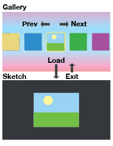
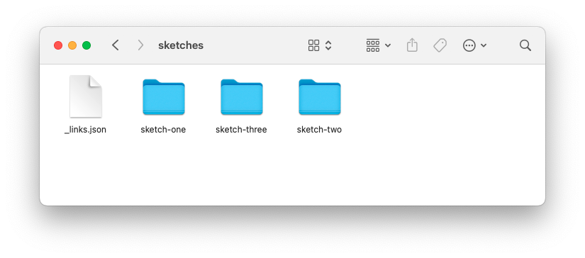

# Creative Coding Showcase

The Creative Coding Showcase app is a way to show outcomes from creative
coding with p5js. I initially developed it to exhibit student outcomes from an
undergraduate class on [Creative Coding Cabinets], but it will also work as a
desktop app. It's designed so that the workflow of downloading and
including sketches is easy, and so that the exhibited works look good.

This readme includes general info on how the showcase app works, what it's
configuration options are, and how to install and run it. For specific
instructions on how to set up for the [Creative Coding Cabinets], see the
[Raspberry-Pi-set-up](Raspberry-Pi-set-up.md) guide.

## Quick start

Download or clone the repository, install [Node.js](https://nodejs.org/en), and
then:

```
$ npm install
$ npm start
```

This will start the showcase app from the command line. If it all works as
expected, you can compile the showcase app and package it for distribution
with the following command:

```
$ npm run make
```

The compiled showcase application will be created in a subfolder of the `out`
directory (exact name will vary depending on your operating system).

## How it works

It works by loading p5js sketches in an
[Electron](https://www.electronjs.org/) app. Since Electron is built on the
chromium browser, it has everything it needs to display a
p5js sketch. By default, the showcase app looks for any
p5js sketches in the following directory:

* `$HOME/Documents/creative-coding-showcase/sketches`

This means that you can add or remove sketches by adding or removing them from
this directory. You can also change the location of this directory via a config
file or command-line switches (detailed below).

There are some extra tweaks to make the sketches look nice, applied through
CSS rules. These style the p5js 'loading' text, reposition the sketch canvas
in the center of the screen, and apply a dark background to the showcase app
window. The CSS tweaks work well for most sketches, but they can be disabled
for particular sketches via a json configuration file (see below).

The showcase app also provides a scrollable gallery interface, so that you can
display many works at once. The user scrolls left and right through the
gallery and then clicks or presses a button to choose a sketch to interact
with, as shown below.



## Configuration files

There are some json files that configure how the showcase works and how each
individual sketch displays.

### config.json

This is a json file located by default in the user's application data
directory. This is operating system dependent:

* macOS: `$Library/Application Support/creative-coding-showcase/config.json`
* raspi: `~/.config/creative-coding-showcase/config.json`

The format of the file with a single object containing the following keys:

* `"cabinetName"` (string): The name you want to give the cabinet (or if
  you're not running on a cabinet, think of it as the name of the showcase).
* `"width"` (number): Width of the showcase app window.
* `"height"` (number): Height of the showcase app window.
* `"fullscreen"` (boolean): If true, the showcase app will run in fullscreen.
* `"debounceTime"` (number): How long (in milliseconds) to 'debounce' input
  from the buttons. This is because the arcade buttons on the arcadeBonnet can
  be a bit jumpy. The larger the number, the less responsive the buttons will
  be.
* `"fixCss"` (boolean): If true, then css fixes will be applied to the
  sketches (e.g. centering the canvas in the window). Can be overridden on a
  sketch by sketch basis in the `_links.json` file.
* `"devTools"` (boolean): If true, then the Chromium developer tools will be
  shown when the app runs. Useful for debugging.
* `"sketchesPath"` (string): Location of the sketches path that should be
  loaded.
* `"allowP5jsImports"` (boolean): If true then the showcase will allow
  for sketches to be imported directly from the p5js editor. Requires
  some additional setup (see below).
* `"importsUrl"` (string): URL for a web page that will accept user
  submissions of p5js editor sketches to import (see below).
* `"permittedImportIdsPath"` (string): Path to a JSON which holds a
  pre-defined list of IDs that you will allow imports from.
* `"hideCursor"` (boolean): Whether or not to hide the cursor. For the
  Dewey cabinet, you probably want to show the cursor, but for the
  other two it doesn't make sense.

Here are the default values for the config file:

```
{
  "cabinetName": "test",
  "width": 1440,
  "height": 900,
  "fullscreen": false,
  "debounceTime": 100,
  "fixCss": true,
  "devTools": true,
  "sketchesPath": "[USER DOCUMENTS]/creative-coding-showcase/sketches"
  "allowP5Imports": false,
  "importsURL": "http://0.0.0.0/imports",
  "permittedImportsIdPath": `[USER DOCUMENTS]/creative-coding-showcase/sketches/_permittedImportIds.json,
  "hideCursor": true  
}
```

### _links.json

This is a json file located in the sketches folder that contains all the
sketches to be displayed. The json format is an object where each key
corresponds to a folder in the sketches folder, e.g. if you had the following
in your sketches folder...



...then the top-level JSON object in `_links.json` should look like this:

```
{
  "sketch-one": {...},
  "sketch-two": {...},
  "sketch-three": {...}
}
```

For each key, there should be an object with the following fields:

* `"first_name"` (String): First name of the author
* `"last_name"` (String): Last name of the author
* `"_has_confirmed"` (Boolean): Whether the author of the sketch has confirmed
  that they want to be in the exhibition. Useful if you need to do a lot of
  pre-processing and may not get final confirmations until quite late.
  If `false`, the sketch will not be displayed.
* `"_cabinet"` (String): Which cabinet the sketch should be shown on, e.g.
  `"huey"`. This can also be a comma-separated list to allow a sketch to be
  shown on more than one cabinet, e.g. `"huey, dewey, louie"`. You can choose
  arbitrary names for the cabinets depending on your needs.
* `"documentation"` (String): Path within the sketch folder to documentation.
* `"instructions"` (String): Path within the sketch folder for instructions.
* `"sketch"` (String): Path to the html file in the sketch folder that
    hosts the sketch (often `index.html`, but not always).
* `"thumb"` (String): Path to an image in the sketch folder for a thumbnail
  image that will be displayed for the sketch in the gallery. 
* `"_found_all_files"` (Boolean): Whether pre-processing found all expected
  files or not.
* `"_missing_files"` (Array): A list of any files that could not be found
  during pre-processing. Useful for diagnosing problems, or knowing
  what needs fixing for a sketch to display properly (e.g. a thumbnail).
* `"_is_buggy"` (Boolean): If true, the sketch will not display in the
  exhibition. Allows you to take a sketch out of the exhibition temporarily
  without having to remove the folder.

For example...

```
{
  "sketch_one": {
    "first_name": "Jana",
    "last_name":  "Scrip",
    "_has_confirmed": false,
    "_cabinet": "dewey",
    "documentation": "sketch-one/creative-sketch-process.pdf",
    "instructions": "sketch-one/README.txt",
    "sketch": "sketch-one/sketch.html",
    "thumb": "sketch-one/images/thumb.png",
    "_found_all_files": true,
    "_missing_files": [],
    "_is_buggy": false
  }
}
```

## Constraints on sketches

There are some constraints on the sketches.

The sketch should not use the `ESC` key because the showcase app relies on
this to **Exit** from a sketch and go back to the gallery.

The sketch should not use the `CTRL+ALT+1` key combination when running on
[Creative Coding Cabinets] because the raspberry pi uses this as a shortcut to
**restart** the showcase app.

The sketch should not use the `CTRL+ALT+3` key combination when running on
[Creative Coding Cabinets] because the raspberry pi uses this as a shortcut to
**quit** the showcase app.

The showcase app also uses the CTRL and
ALT keys to navigate left and right when in the gallery view. However,
if a sketch also uses these, it should not interfere.

Also note that if the showcase app is being used on the [Creative Coding
Cabinets], then other hardware and input limitations may apply (e.g. only
joystick and button inputs are available on the 'Louie' cabinet). See the
[Creative Coding Cabinets] repository for a full list.

| Key  | Used for             |
| ---- | -------------------- |
| CTRL | Navigate left        |
| ALT  | Navigate right       |
| ESC  | Load / Exit a sketch |

## Installation

Download or clone this repository. Install
[Node](https://nodejs.org/en). I have built the app with node v20.13.1.

In a terminal window, type the following commands to install the
required libraries and start the showcase for the first run.

```
npm install
npm start
```

This will start the application with some example content you can use
to test. It will also generate a default `config.json` file in your
system configuration directory, which you can edit to change how the
showcase app works. You can exit the app from the menu, or by typing 
CTRL+C from the terminal.

## Command line switches

To test with command-line switches (note - this doesn't seem to work on
the raspberry pi)

`./node_modules/.bin/electron main.js --SWITCH=VALUE`

Supported command line switches and values are the same as the
`config.json` file options. This makes it easy to change the way the
app runs without having to edit the config file.

## Adding sketches

Copy any sketch folders you want to add to the
`creative-coding-showcase/sketches` folder in your documents folder
(or wherever you've configured this to be). If sketches have been
downloaded straight from the p5js website, they should work fine. If
rely on external URLs (e.g. sketches using the ml5 library) they will
only work if the showcase has an internet connection.

Also add an entry for the sketch into the `_links.json` file using the
format described above. If I am preparing a large number of sketches,
I use a simple script to generate this, but these are too custom to
include here.

## Importing sketches

TO BE ADDED.

[Creative Coding Cabinets]: https://github.com/jareddonovan/creative-coding-cabinets
